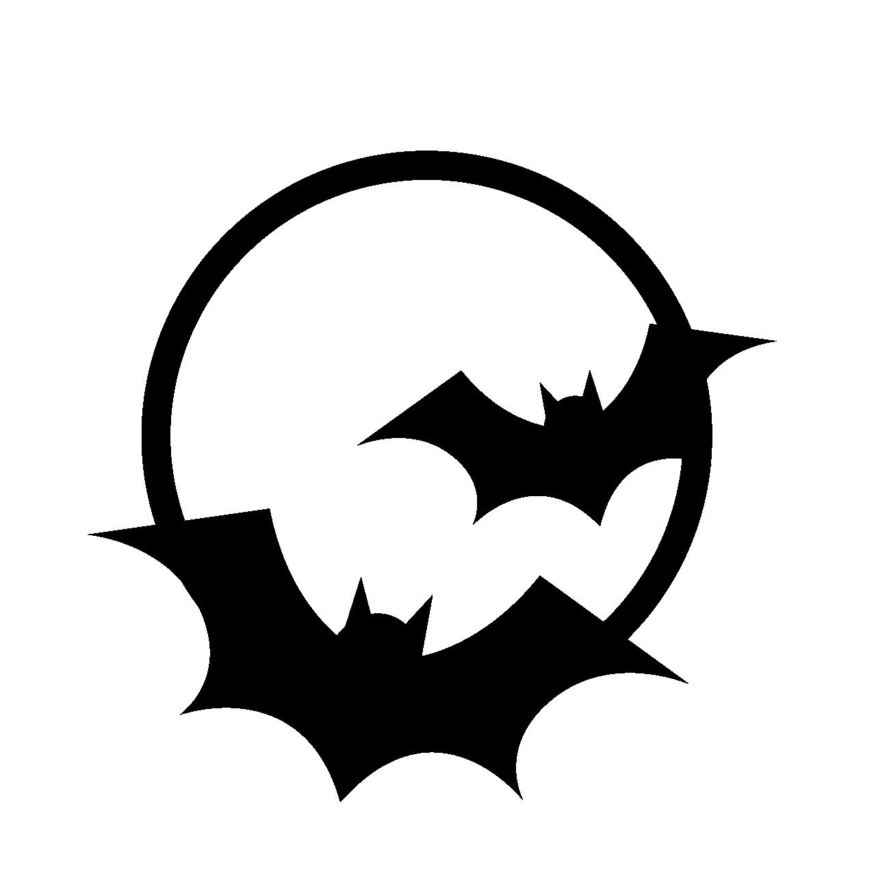

[](https://github.com/nao1215/morrigan/actions/workflows/build.yml)
[](https://github.com/nao1215/morrigan/actions/workflows/unit_test.yml)
[](https://codecov.io/gh/nao1215/morrigan)
[](https://github.com/nao1215/morrigan/actions/workflows/reviewdog.yml)
[](https://goreportcard.com/report/github.com/nao1215/morrigan)
<div align="center">

</div>

# morrigan - Penetration Tool Set
morrigan command is a tool-set to verify the vulnerability of services developed by you. Like [busybox](https://busybox.net) in the embedded platform, morrigan provides multiple functions in a single binary to complete the task. morrigan is not a tool to attack services on the network. We will be adding subcommands regarding penetration as part of the developer's (it's me) study of security.  
  
### **morrigan sub-command list**
Each subcommand is explained on other pages. We plan to add more subcommands. We will be reimplementing existing commands used in penetration in golang. However, we will also implement morrigan's own subcommands.
  
|sub-command | description |forked from or inspired by|
|:--|:--|:--|
|license|Print the license of the package (or subcommand) used in the morrigan|-|
|log-collect|Collect the logs that exist in the system| - |
|[netcat](./docs/netcat.md)| listen TCP/UDP ports and send data to remote ports over TCP/UDP|forked from [go-netcat](https://github.com/vfedoroff/go-netcat)|
|[ping](./docs/ping.md)|send ICMP ECHO_REQUEST to network hosts|forked from [u-root project](https://github.com/u-root/u-root)|
|[pwcrack](./docs/pwcrack.md)| crack local user password|inspired by [John the ripper](https://www.openwall.com/john/)|
|pwlist|generate password list files that be used in morrigan|-|
|[pwscore](./docs/pwscore.md)| [WIP] check password strength|inspired by [libpwquality](https://github.com/libpwquality/libpwquality)|
|[unshadow](./docs/unshadow.md)| combine password fields in /etc/passwd and /etc/shadow|inspired by [John the ripper](https://www.openwall.com/john/)|
|[whris](./docs/whris.md)|Displays management information for IPs associated with the domain|forked from [whris](https://github.com/harakeishi/whris)|
|[zip-pwcrack](./docs/zip-pwcrack.md)|crack zip password|inspired by [ICHINOSE Shogo](https://github.com/shogo82148)|  
  
The subcommands we plan to add to morrigan are as follows:
- shbin: Obfuscate shell scripts.
- nmap: Network exploration tool and security / port scanner
- tcpdump: dump traffic on a network
- crunch: Generate a dictionary file containing words using the given characters (e.g. 0123456789abcdef)
- scp: secure copy
- ftp: File Transfer Protocol
- cve: Search CVE
  
### **Legal Warning**
> With great power comes great responsibility.

morrign command is **under development**. There are no features that compromise security in any way. However,I will be adding subcommands for penetration in stages.  

**Please use the morrigan command only on PCs and servers that you control.** Do not use morrigan command in military or secret service organizations, or for illegal purposes. You may be held legally liable for your actions.  


# How to install
### Use "go install"
If you does not have the golang development environment installed on your system, please install golang from the [golang official website](https://go.dev/doc/install).
```shell
go install github.com/nao1215/morrigan@latest
```

### Use homebrew
```shell
brew install nao1215/tap/morrigan
```


### Install from Package or Binary
[The release page](https://github.com/nao1215/morrigan/releases) contains packages in .deb, .rpm, and .apk formats.


# Contributing
First off, thanks for taking the time to contribute! ❤️  See [CONTRIBUTING.md](./CONTRIBUTING.md) for more information.
Contributions are not only related to development. For example, GitHub Star motivates me to develop!!  
[](https://star-history.com/#nao1215/morrigan&Date)

# Contact
If you would like to send comments such as "find a bug" or "request for additional features" to the developer, please use one of the following contacts.

- [GitHub Issue](https://github.com/nao1215/morrigan/issues)
- [Twitter](https://twitter.com/morrigan_pt)

# LICENSE
The morrigan project is licensed under the terms of [MIT LICENSE](./LICENSE).
