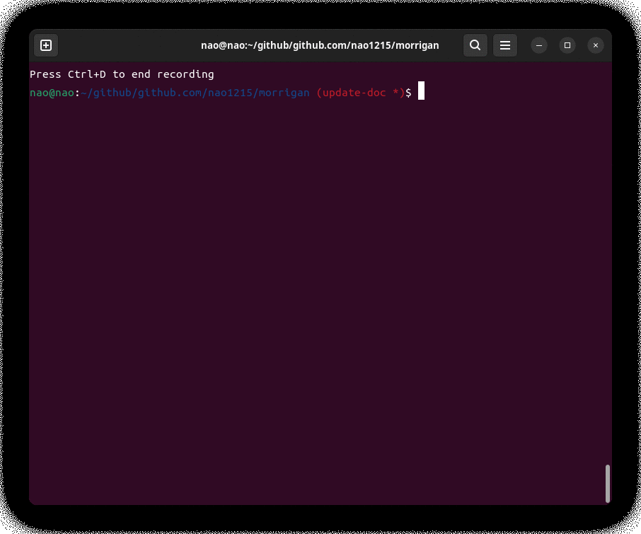

# pwcrack
pwcrack subcommand crack password for local accounts. It does not yet support password cracking of users over the network.
  
The password cracking method is simple: the morrigan command has an embedded password list. The passwords on the list are compared to the encrypted passwords (hash) in the [unshadow file](./unshadow.md) until they match.  
  
It will support a brute force attack. However, it has not yet been implemented.

# Synopsis
```
morrigan pwcrack USERNAME [flags]
```

# Examples
